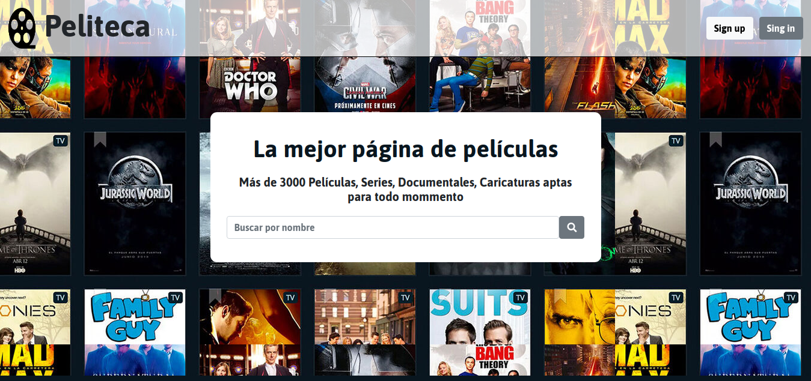
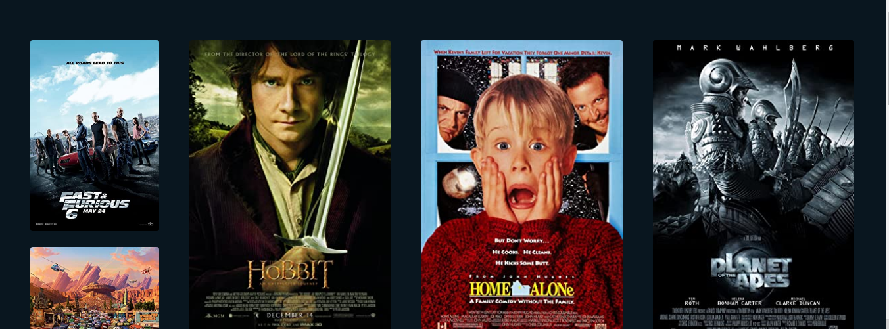

# Cineteca
Proyecto de práctica que simula un servicio de Streaming sobre peliculas

# Advertencia

El proyecto utiliza 2 APIs para su funcionamiento

- Youtube Data API
- OMB API

y las credenciales para poder utilzar las APIs no fueron agregadas, por lo que para el funcionamiento del proyecto deben ser generadas y agregadas.
